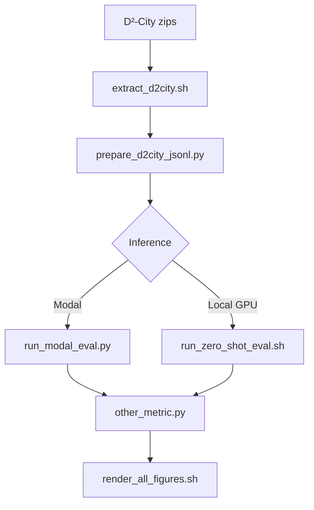

# LocateAnything on Real Traffic: A Zero-Shot Evaluation on D²-City Dashcam Video

A zero-shot evaluation of LocateAnything-3B on D²-City, with no fine-tuning, no domain adaptation, just the pretrained model pointed at real traffic

[Medium](https://medium.com/@faheemgurkani/can-a-generalist-vision-language-model-see-traffic-3ec6a85cf4d5) · [Substack](https://therepresentationmanifold.substack.com/p/can-a-generalist-vision-language) · [LocateAnything-3B](https://huggingface.co/nvidia/LocateAnything-3B) · [D²-City](https://www.scidb.cn/en/detail?dataSetId=804399692560465920)

[](LICENSE)

## Abstract

We evaluate **pretrained [LocateAnything-3B](https://huggingface.co/nvidia/LocateAnything-3B)** zero-shot on **[D²-City](https://www.d2-city.org/)** dashcam validation footage — no fine-tuning, no domain adaptation. The model receives six open-vocabulary queries per frame (`car`, `bus`, `truck`, `person`, `bicycle`, `motorcycle`); predictions are scored with NVIDIA's official [`other_metric.py`](https://github.com/NVlabs/Eagle/tree/main/Embodied/evaluation/metrics/other_metric.py).

**Research question:** *Does a generalist vision-language model work for driver assistance out of the box?*

This repository provides the full pipeline: data preparation, Modal-based inference (or local GPU), metrics, and reproducibility figures.

## Main results

**Setup:** 500-frame D²-City val subset · Modal L40S · hybrid mode · 499/500 frames scored (1 HTTP 408 timeout)

| Metric @ IoU | Precision | Recall | F1 |
|--------------|-----------|--------|-----|
| **0.50** | **0.669** | **0.778** | **0.719** |
| 0.90 | 0.257 | 0.293 | 0.274 |
| 0.95 | 0.077 | 0.088 | 0.082 |
| **mIoU** (0.50–0.95) | **0.477** | **0.555** | **0.513** |

| Auxiliary (IoU 0.5) | Value |
|---------------------|-------|
| Instance follow rate | 0.9965 |
| Wrong rejection rate | 0.0000 |

| Latency | Value |
|---------|-------|
| Mean / median | ~668 ms / ~639 ms (~1.5 FPS) |
| Wall time (500 frames) | ~34 min |

**Takeaway:** Strong coarse localization and near-perfect instance follow-through, but tight box accuracy and real-time throughput fall short of production ADAS requirements.

## Quick start

```bash
git clone https://github.com/YOUR_USER/locateanything-d2city-zero-shot-eval.git
cd locateanything-d2city-zero-shot-eval

git clone https://github.com/NVlabs/Eagle.git eagle
python3 -m venv .venv && source .venv/bin/activate
pip install -r requirements.txt
```

1. Download D²-City val zips → `data/d2_city/` ([SciDB](https://www.scidb.cn/en/detail?dataSetId=804399692560465920)) — see [data/README.md](data/README.md)
2. Set `paths.data_root_mode: local` in `config/d2city_eval.yaml` (standalone) or keep `monorepo` if nested in [driver-assistance-system-using-RT-DETR](https://github.com/)
3. Prepare data → deploy Modal → run full pipeline:

```bash
bash scripts/extract_d2city.sh val
python scripts/prepare_d2city_jsonl.py

# One-time Modal setup — see modal/README.md
python -m modal run modal/download.py::download_model
python -m modal deploy modal/app.py
export MODAL_API_URL=https://YOUR-WORKSPACE--....modal.run

bash scripts/reproduce_results.sh --skip-modal   # if predictions exist, skip inference
# or full run:
bash scripts/reproduce_results.sh
```

## Installation

| Requirement | Notes |
|-------------|-------|
| Python 3.10+ | `pip install -r requirements.txt` |
| NVlabs/Eagle | `git clone https://github.com/NVlabs/Eagle.git eagle` |
| Hugging Face | Accept [LocateAnything-3B license](https://huggingface.co/nvidia/LocateAnything-3B) |
| Modal account | Cloud inference — [modal.com](https://modal.com/) |
| D²-City val zips | ~1.3 GB — [SciDB download](https://www.scidb.cn/en/detail?dataSetId=804399692560465920) |
| Disk | ~2 GB for processed subset |

```bash
bash scripts/setup_env.sh      # optional: venv + Eagle editable install
bash scripts/setup_modal.sh    # Modal client deps
```

## Usage

### Data preparation

```bash
bash scripts/extract_d2city.sh val
python scripts/prepare_d2city_jsonl.py          # 500 frames, 3,974 GT boxes
python scripts/prepare_d2city_jsonl.py --dry-run  # count only
python scripts/paths.py all                       # verify resolved paths
```

### Inference (Modal — recommended)

```bash
python scripts/test_modal_client.py --url "$MODAL_API_URL" --from-jsonl
python scripts/run_modal_eval.py --url "$MODAL_API_URL"
```

Details: [modal/README.md](modal/README.md)

### Metrics & figures

```bash
python eagle/Embodied/evaluation/metrics/other_metric.py \
  --data_path "$(python scripts/paths.py modal-jsonl)" \
  --output_path results/D2City_val/modal/eval_results.json

bash scripts/render_all_figures.sh
```

### Local GPU (optional)

```bash
hf download nvidia/LocateAnything-3B --local-dir models/LocateAnything-3B
bash scripts/run_zero_shot_eval.sh
```

Requires CUDA + Flash Attention 2. See [Eagle/Embodied](https://github.com/NVlabs/Eagle/tree/main/Embodied).

## Configuration

All paths and eval settings live in `config/d2city_eval.yaml`.

**Data path toggle:**

| Mode | Setting | Location |
|------|---------|----------|
| Standalone | `data_root_mode: local` | `./data/d2_city/` |
| Monorepo | `data_root_mode: monorepo` | `<parent-repo>/data/d2_city/` |
| Custom | `data_root: /path` | Override |

**Key eval settings:**

| Setting | Default | Effect |
|---------|---------|--------|
| `eval.frame_stride` | 30 | ~1 fps sampling |
| `eval.max_frames_per_video` | 5 | ~500 frames total |
| `model.generation_mode` | hybrid | hybrid \| fast \| slow |
| `modal.timeout_sec` | 600 | Per-frame HTTP timeout |

Set `max_frames_per_video: null` for full validation (~2,473 frames).

## Dataset

**D²-City** — large-scale Chinese dashcam dataset (1920×1080, CVAT XML annotations).

| Subset stat | Value |
|-------------|-------|
| Split / city | Validation `0008` |
| Clips | 100 |
| Eval frames | 500 (5 per clip, stride 30) |
| GT boxes | 3,974 |
| By class | car 2,980 · person 330 · truck 228 · bus 205 · bicycle 155 · motorcycle 76 |

Download and layout: [data/README.md](data/README.md)

## Project structure

```
├── config/d2city_eval.yaml
├── scripts/
│   ├── reproduce_results.sh      # end-to-end pipeline
│   ├── render_all_figures.sh
│   ├── extract_d2city.sh
│   ├── prepare_d2city_jsonl.py
│   ├── run_modal_eval.py
│   └── run_zero_shot_eval.sh
├── modal/                        # self-hosted FastAPI on Modal
├── eagle/                        # gitignored — clone NVlabs/Eagle
├── data/                         # gitignored
└── results/                      # gitignored — metrics + figures
```



## Outputs

| Artifact | Path |
|----------|------|
| Eval JSONL | `D2City_val.jsonl` |
| Predictions | `D2City_val_modal_answer.jsonl` |
| Metrics | `results/D2City_val/modal/eval_results.json` |
| Figures | `results/figures/*.png` |

## Troubleshooting

| Issue | Fix |
|-------|-----|
| `eagle/ not found` | `git clone https://github.com/NVlabs/Eagle.git eagle` |
| `MODAL_API_URL` unset | Deploy `modal/app.py`; set in `.env` |
| Modal 408 timeout | Increase `modal.timeout_sec`; retry failed frame |
| Wrong data path | `paths.data_root_mode: local` for standalone |
| zsh `<hash>` error | Use `--from-jsonl` in test client |

## Citation & references

If you use this evaluation harness, please cite the articles and upstream work:

**Articles**

- Faheem, M. *Can a Generalist Vision-Language Model See Traffic?* Medium, 2026. [Link](https://medium.com/@faheemgurkani/can-a-generalist-vision-language-model-see-traffic-3ec6a85cf4d5)
- Faheem, M. *LocateAnything on Real Traffic: A Zero-Shot Evaluation on D²-City Dashcam Video.* Substack, 2026. [Link](https://therepresentationmanifold.substack.com/p/can-a-generalist-vision-language)

**Upstream**

| Resource | Link |
|----------|------|
| LocateAnything | [Paper / project](https://research.nvidia.com/labs/lpr/locate-anything/) |
| Model weights | [Hugging Face](https://huggingface.co/nvidia/LocateAnything-3B) |
| Eval code | [NVlabs/Eagle](https://github.com/NVlabs/Eagle/tree/main/Embodied) |
| D²-City | [SciDB](https://www.scidb.cn/en/detail?dataSetId=804399692560465920) · [Project](https://www.d2-city.org/) |
| Modal deployment pattern | [rohit4242/locateanything-modal](https://github.com/rohit4242/locateanything-modal) (reference only; not cloned) |

> NVIDIA does not host a public REST API for LocateAnything. Inference is self-hosted via Modal or local GPU.

## License

This repository: **[MIT](LICENSE)** (Copyright © 2026 Muhammad Faheem)

Third-party terms apply to [LocateAnything-3B](https://huggingface.co/nvidia/LocateAnything-3B) (NVIDIA) and [D²-City](https://www.d2-city.org/).
