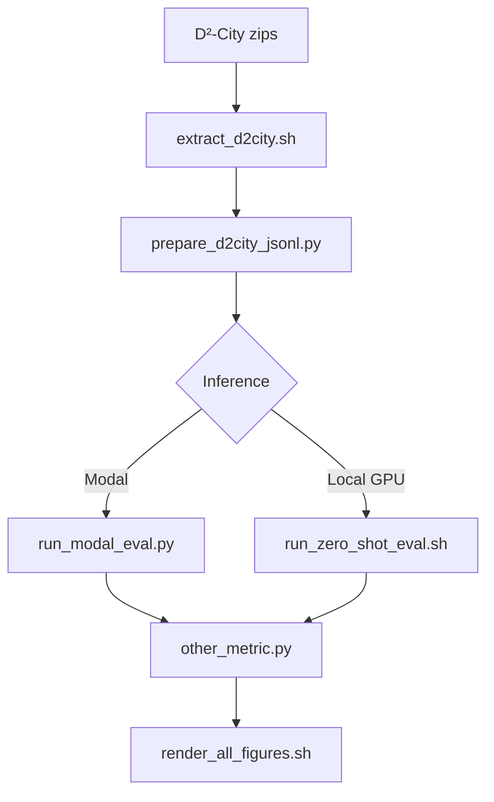

# LocateAnything on Real Traffic: A Zero-Shot Evaluation on D²-City Dashcam Video

A zero-shot evaluation of LocateAnything-3B on D²-City, with no fine-tuning, no domain adaptation — just the pretrained model pointed at real traffic.

## Overview

This repository provides:

- **`scripts/prepare_d2city_jsonl.py`** — Build a 500-frame D²-City validation subset with ground-truth boxes
- **`scripts/run_modal_eval.py`** — Batch zero-shot inference via a self-hosted Modal API
- **`scripts/reproduce_results.sh`** — End-to-end replication (data → inference → metrics → figures)
- **`modal/app.py`** — FastAPI deployment for LocateAnything-3B on Modal (L40S)

The evaluation pipeline:

1. Extract D²-City validation videos and annotations
2. Sample frames and build LocateAnything-compatible JSONL
3. Run open-vocabulary detection (`car`, `bus`, `truck`, `person`, `bicycle`, `motorcycle`)
4. Score predictions with NVIDIA's official `other_metric.py`
5. Generate reproducibility figures (IoU curve, latency, GT vs prediction)

**Research question:** *Does a generalist vision-language model work for driver assistance out of the box?*

## Main results

**Setup:** 500-frame D²-City val subset · Modal L40S · hybrid mode · 499/500 frames scored (1 HTTP 408 timeout)

| Metric @ IoU | Precision | Recall | F1 |
|--------------|-----------|--------|-----|
| **0.50** | **0.669** | **0.778** | **0.719** |
| 0.90 | 0.257 | 0.293 | 0.274 |
| 0.95 | 0.077 | 0.088 | 0.082 |
| **mIoU** (0.50–0.95) | **0.477** | **0.555** | **0.513** |

| Auxiliary (IoU 0.5) | Value |
|---------------------|-------|
| Instance follow rate | 0.9965 |
| Wrong rejection rate | 0.0000 |

| Latency | Value |
|---------|-------|
| Mean / median | ~668 ms / ~639 ms (~1.5 FPS) |
| Wall time (500 frames) | ~34 min |

**Takeaway:** Strong coarse localization and near-perfect instance follow-through, but tight box accuracy and real-time throughput fall short of production ADAS requirements.

## Prerequisites

- Python 3.10+
- Modal account (recommended inference path; no local GPU required)
- Hugging Face account with LocateAnything-3B license accepted
- NVlabs/Eagle clone for metrics (`git clone https://github.com/NVlabs/Eagle.git eagle`)
- D²-City validation zips (~1.3 GB) — see Resources
- ~2 GB disk for processed subset

## Quick Start

### 1. Clone repository

```bash
git clone https://github.com/YOUR_USER/locateanything-d2city-zero-shot-eval.git
cd locateanything-d2city-zero-shot-eval

git clone https://github.com/NVlabs/Eagle.git eagle
```

### 2. Create Python environment

```bash
python3 -m venv .venv
source .venv/bin/activate
pip install -r requirements.txt
```

Or use setup helpers:

```bash
bash scripts/setup_env.sh
bash scripts/setup_modal.sh
```

### 3. Download D²-City validation data

Place archives under `data/d2_city/`:

```
data/d2_city/
├── validation-annotation.zip
└── validation-video.zip
```

For standalone clones, set `paths.data_root_mode: local` in `config/d2city_eval.yaml`. See [data/README.md](data/README.md).

### 4. Prepare eval subset

```bash
bash scripts/extract_d2city.sh val
python scripts/prepare_d2city_jsonl.py
```

Expected: **500 frames**, **3,974** ground-truth boxes.

### 5. Deploy Modal API (one-time)

```bash
python -m modal run modal/download.py::download_model
python -m modal deploy modal/app.py
export MODAL_API_URL=https://YOUR-WORKSPACE--....modal.run
```

See [modal/README.md](modal/README.md) for secrets and troubleshooting.

### 6. Run full pipeline

```bash
python scripts/test_modal_client.py --url "$MODAL_API_URL" --from-jsonl
bash scripts/reproduce_results.sh
```

Runtime: ~34 min for 500 frames on Modal L40S (hybrid mode).

## Usage

### Data preparation

```bash
python scripts/prepare_d2city_jsonl.py --dry-run   # count only
python scripts/paths.py all                       # verify paths
```

### Inference (Modal — recommended)

```bash
python scripts/run_modal_eval.py --url "$MODAL_API_URL"
```

### Metrics and figures

```bash
python eagle/Embodied/evaluation/metrics/other_metric.py \
  --data_path "$(python scripts/paths.py modal-jsonl)" \
  --output_path results/D2City_val/modal/eval_results.json

bash scripts/render_all_figures.sh
```

### Local GPU (optional)

```bash
hf download nvidia/LocateAnything-3B --local-dir models/LocateAnything-3B
bash scripts/run_zero_shot_eval.sh
```

Requires CUDA + Flash Attention 2.

## Configuration

All settings in `config/d2city_eval.yaml`.

**Data path toggle:**

| Mode | Setting | Location |
|------|---------|----------|
| Standalone | `data_root_mode: local` | `./data/d2_city/` |
| Monorepo | `data_root_mode: monorepo` | `<parent-repo>/data/d2_city/` |
| Custom | `data_root: /path` | Override |

**Key eval settings:**

| Setting | Default | Effect |
|---------|---------|--------|
| `eval.frame_stride` | 30 | ~1 fps sampling |
| `eval.max_frames_per_video` | 5 | ~500 frames total |
| `model.generation_mode` | hybrid | hybrid \| fast \| slow |
| `modal.timeout_sec` | 600 | Per-frame HTTP timeout |

Set `max_frames_per_video: null` for full validation (~2,473 frames).

## Dataset

**D²-City** — large-scale Chinese dashcam dataset (1920×1080, CVAT XML annotations).

| Subset stat | Value |
|-------------|-------|
| Split / city | Validation `0008` |
| Clips | 100 |
| Eval frames | 500 (5 per clip, stride 30) |
| GT boxes | 3,974 |
| By class | car 2,980 · person 330 · truck 228 · bus 205 · bicycle 155 · motorcycle 76 |

## Key files

| File | Purpose |
|------|---------|
| `scripts/reproduce_results.sh` | End-to-end replication |
| `scripts/render_all_figures.sh` | Regenerate article figures |
| `scripts/extract_d2city.sh` | Unzip D²-City archives |
| `scripts/prepare_d2city_jsonl.py` | Build eval JSONL + frames |
| `scripts/run_modal_eval.py` | Batch Modal inference |
| `scripts/run_zero_shot_eval.sh` | Local GPU inference + metrics |
| `modal/app.py` | Modal FastAPI deployment |
| `config/d2city_eval.yaml` | Paths, classes, sampling |



## Outputs

| Artifact | Path |
|----------|------|
| Eval JSONL | `D2City_val.jsonl` |
| Predictions | `D2City_val_modal_answer.jsonl` |
| Metrics | `results/D2City_val/modal/eval_results.json` |
| Figures | `results/figures/*.png` |

## Troubleshooting

| Issue | Fix |
|-------|-----|
| `eagle/ not found` | `git clone https://github.com/NVlabs/Eagle.git eagle` |
| `MODAL_API_URL` unset | Deploy `modal/app.py`; set in `.env` |
| Modal 408 timeout | Increase `modal.timeout_sec`; retry failed frame |
| Wrong data path | `paths.data_root_mode: local` for standalone |
| zsh `<hash>` error | Use `--from-jsonl` in test client |

## Resources

**Articles**

- Medium — *Can a Generalist Vision-Language Model See Traffic?*  
  https://medium.com/@faheemgurkani/can-a-generalist-vision-language-model-see-traffic-3ec6a85cf4d5

- Substack — *LocateAnything on Real Traffic: A Zero-Shot Evaluation on D²-City Dashcam Video*  
  https://therepresentationmanifold.substack.com/p/can-a-generalist-vision-language

**LocateAnything**

- Paper / project: https://research.nvidia.com/labs/lpr/locate-anything/
- Model weights: https://huggingface.co/nvidia/LocateAnything-3B
- Official code: https://github.com/NVlabs/Eagle/tree/main/Embodied
- Hugging Face demo: https://huggingface.co/spaces/nvidia/LocateAnything

**D²-City**

- Download (SciDB): https://www.scidb.cn/en/detail?dataSetId=804399692560465920
- Project page: https://www.d2-city.org/

**Infrastructure**

- Modal docs: https://modal.com/docs
- Modal deployment pattern (reference only, not cloned): https://github.com/rohit4242/locateanything-modal

> NVIDIA does not host a public REST API for LocateAnything. Inference is self-hosted via Modal or local GPU.

## Citation

If you use this evaluation harness or reference this work, please cite:

```bibtex
@article{faheem2026locateanything_medium,
  title   = {Can a Generalist Vision-Language Model See Traffic?},
  author  = {Faheem, Muhammad},
  journal = {Medium},
  year    = {2026},
  url     = {https://medium.com/@faheemgurkani/can-a-generalist-vision-language-model-see-traffic-3ec6a85cf4d5}
}

@article{faheem2026locateanything_substack,
  title   = {LocateAnything on Real Traffic: A Zero-Shot Evaluation on D²-City Dashcam Video},
  author  = {Faheem, Muhammad},
  journal = {The Representation Manifold (Substack)},
  year    = {2026},
  url     = {https://therepresentationmanifold.substack.com/p/can-a-generalist-vision-language}
}
```

Please also cite the upstream LocateAnything model and D²-City dataset per their respective terms.

## License

`locateanything-d2city-zero-shot-eval` is **MIT** licensed, as found in the [LICENSE](LICENSE) file (Copyright © 2026 Muhammad Faheem).

This project follows the licensing of underlying components:

- **LocateAnything-3B / Eagle:** NVIDIA non-commercial license — see [Hugging Face model card](https://huggingface.co/nvidia/LocateAnything-3B)
- **D²-City:** Dataset terms — see [d2-city.org](https://www.d2-city.org/)
