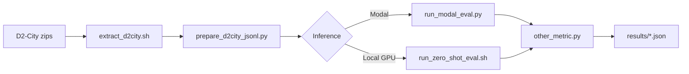

# locateanything-d2city-zero-shot-eval

Zero-shot evaluation of **pretrained [LocateAnything-3B](https://huggingface.co/nvidia/LocateAnything-3B)** on **[D2-City](https://www.d2-city.org/)** dashcam validation data — no fine-tuning.

**Research question:** Does LocateAnything work for driver assistance out of the box?

This pipeline prepares D2-City frames, runs open-vocabulary detection via Modal (or local GPU), and computes box-level F1/recall metrics compatible with the official [NVlabs/Eagle](https://github.com/NVlabs/Eagle/tree/main/Embodied) evaluation scripts.

---

## References

| Resource | Link |
|----------|------|
| LocateAnything paper & project | [research.nvidia.com/labs/lpr/locate-anything/](https://research.nvidia.com/labs/lpr/locate-anything/) |
| Model weights (HF) | [huggingface.co/nvidia/LocateAnything-3B](https://huggingface.co/nvidia/LocateAnything-3B) |
| Official code (Embodied) | [github.com/NVlabs/Eagle/tree/main/Embodied](https://github.com/NVlabs/Eagle/tree/main/Embodied) |
| Hugging Face demo Space | [huggingface.co/spaces/nvidia/LocateAnything](https://huggingface.co/spaces/nvidia/LocateAnything) |
| Modal deployment pattern | [github.com/rohit4242/locateanything-modal](https://github.com/rohit4242/locateanything-modal) |
| Modal docs (Volumes, Secrets) | [modal.com/docs](https://modal.com/docs) |
| D2-City dataset (SciDB download) | [scidb.cn — D²-City](https://www.scidb.cn/en/detail?dataSetId=804399692560465920) |
| D2-City project page | [d2-city.org](https://www.d2-city.org/) |

> **Note:** NVIDIA does not host a public REST API for LocateAnything. Inference is self-hosted (Modal, local GPU, RunPod, etc.) using the HF weights and Eagle eval code.

---

## Directory layout

```
locateanything-d2city-zero-shot-eval/
├── README.md
├── .gitignore
├── .env.example
├── config/
│   └── d2city_eval.yaml       # paths toggle, classes, sampling, Modal URL
├── data/                      # gitignored — see data/README.md
├── scripts/
│   ├── paths.py               # resolve data/output paths from config
│   ├── setup_env.sh           # local GPU env + Eagle install
│   ├── setup_modal.sh         # Modal client deps
│   ├── extract_d2city.sh      # unzip D2-City archives
│   ├── prepare_d2city_jsonl.py
│   ├── run_modal_eval.py      # batch inference via Modal API
│   ├── run_zero_shot_eval.sh  # local GPU inference + metrics
│   └── test_modal_client.py   # smoke test
├── modal/
│   ├── app.py                 # FastAPI /detect endpoint (L40S)
│   ├── download.py            # one-time HF weight download → Volume
│   └── README.md
├── eagle/                     # gitignored — clone NVlabs/Eagle here
├── models/                    # gitignored — hf download target
└── results/                   # gitignored — eval outputs
```

---

## Data path toggle

All scripts read `config/d2city_eval.yaml` → `paths` section.

| Mode | Config | Data location |
|------|--------|---------------|
| **Monorepo** (default) | `data_root_mode: monorepo` | `<parent-repo>/data/d2_city/` |
| **Standalone** | `data_root_mode: local` | `./data/d2_city/` at project root |
| **Custom** | `data_root: /path/to/data` | Explicit override |

```yaml
paths:
  data_root_mode: monorepo   # monorepo | local
  data_root: null            # optional override
  repo_root: "../../.."      # only for monorepo mode
```

Verify resolved paths:

```bash
python scripts/paths.py all
# or individually:
python scripts/paths.py data-root
python scripts/paths.py jsonl
```

See [data/README.md](data/README.md) for D2-City download and zip layout.

---

## Quick start

### 1. Clone dependencies

```bash
git clone https://github.com/YOUR_USER/locateanything-d2city-zero-shot-eval.git
cd locateanything-d2city-zero-shot-eval

# LocateAnything eval code (required for metrics + local GPU path)
git clone https://github.com/NVlabs/Eagle.git eagle
```

### 2. Python environment

```bash
bash scripts/setup_env.sh
source .venv/bin/activate
```

For Modal-only workflow:

```bash
bash scripts/setup_modal.sh   # installs modal, requests, pycocotools, …
cp .env.example .env          # add MODAL_API_URL after deploy
```

### 3. D2-City data

**Standalone:** set `paths.data_root_mode: local`, download zips from [SciDB (D²-City)](https://www.scidb.cn/en/detail?dataSetId=804399692560465920) per [data/README.md](data/README.md), place under `data/d2_city/`.

**Monorepo:** keep default config; data lives in parent repo `data/d2_city/`.

```bash
bash scripts/extract_d2city.sh val
python scripts/prepare_d2city_jsonl.py
```

Default sampling (`frame_stride: 30`, `max_frames_per_video: 5`) yields **~500 eval frames** from 100 validation clips.

### 4a. Inference via Modal (no local GPU)

Prerequisites:

1. [Modal](https://modal.com/) account + CLI: `pip install modal && modal token set …`
2. Modal secret **`huggingface-secret`** with `HF_TOKEN` ([HF token](https://huggingface.co/settings/tokens); accept [NVIDIA model license](https://huggingface.co/nvidia/LocateAnything-3B) first)

```bash
# One-time: download ~8 GB weights into Modal Volume
python -m modal run modal/download.py::download_model

# Deploy persistent API → copy *.modal.run URL
python -m modal deploy modal/app.py
export MODAL_API_URL=https://YOUR-WORKSPACE--locateanything-3b-....modal.run

# Smoke test (uses first JSONL frame)
python scripts/test_modal_client.py --url "$MODAL_API_URL" --from-jsonl

# Batch eval (~33 min for 500 frames on L40S)
python scripts/run_modal_eval.py
```

Details: [modal/README.md](modal/README.md).

**Other cloud providers:** The client only needs an HTTP POST endpoint matching `/detect` (see `modal/app.py`). You can adapt the same FastAPI app for RunPod, AWS, GCP, etc.

### 4b. Inference via local GPU

```bash
# Accept NVIDIA license on Hugging Face, then:
hf download nvidia/LocateAnything-3B --local-dir models/LocateAnything-3B

bash scripts/run_zero_shot_eval.sh
```

Requires CUDA + Flash Attention 2 (recommended). See [Eagle/Embodied README](https://github.com/NVlabs/Eagle/tree/main/Embodied).

### 5. Metrics

```bash
python eagle/Embodied/evaluation/metrics/other_metric.py \
  --data_path "$(python scripts/paths.py modal-jsonl)" \
  --output_path results/D2City_val/modal/eval_results.json
```

Install deps if needed: `pip install pycocotools shapely`

---

## Eval configuration

Key settings in `config/d2city_eval.yaml`:

| Setting | Default | Description |
|---------|---------|-------------|
| `eval.query_classes` | 6 ADAS classes | Open-vocab queries sent to LocateAnything |
| `eval.frame_stride` | 30 | Sample every Nth frame (~1 fps) |
| `eval.max_frames_per_video` | 5 | Cap per clip (~500 total) |
| `model.generation_mode` | hybrid | hybrid \| fast \| slow |
| `modal.timeout_sec` | 600 | Per-frame HTTP timeout |

**Full val eval:** set `max_frames_per_video: null` (~2,473 frames).

---

## Pipeline overview



---

## Sample results (500-frame subset, Modal L40S)

At IoU=0.5 on D2-City val (499/500 frames; one timeout):

| Metric | Value |
|--------|-------|
| Precision | 0.669 |
| Recall | 0.778 |
| F1 | 0.719 |

Output: `results/D2City_val/modal/eval_results.json`

---

## Comparison with RT-DETR

This repo produces a fixed JSONL (`D2City_val.jsonl`) with GT boxes. Fine-tuned RT-DETR from the parent [driver-assistance-system-using-RT-DETR](https://github.com/) project can be evaluated on the **same frames** for a fair zero-shot vs fine-tuned comparison.

---

## Troubleshooting

| Issue | Fix |
|-------|-----|
| `Annotations not found` | Run `extract_d2city.sh val`; check `python scripts/paths.py data-root` |
| `eagle/ not found` | `git clone https://github.com/NVlabs/Eagle.git eagle` |
| Modal 408 timeout | Increase `modal.timeout_sec` or retry failed frames |
| `pycocotools` missing | `pip install pycocotools shapely` |
| HF model access denied | Accept license at [LocateAnything-3B](https://huggingface.co/nvidia/LocateAnything-3B) |
| Wrong data path | Toggle `paths.data_root_mode` or set `paths.data_root` |

---

## License

- This evaluation harness: follow your repo license.
- LocateAnything model & Eagle code: [NVIDIA license](https://huggingface.co/nvidia/LocateAnything-3B).
- D2-City: [SciDB download](https://www.scidb.cn/en/detail?dataSetId=804399692560465920) · [dataset terms](https://www.d2-city.org/)
