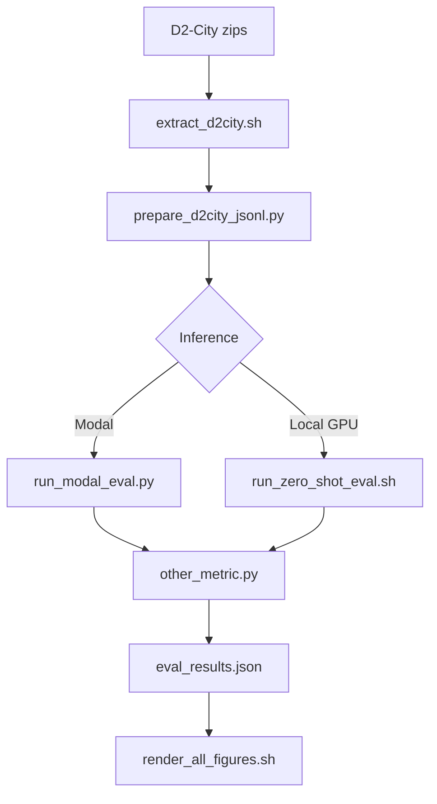

# locateanything-d2city-zero-shot-eval

**Article:** [Can a Generalist Vision-Language Model See Traffic?](https://medium.com/@faheemgurkani/can-a-generalist-vision-language-model-see-traffic-3ec6a85cf4d5) — Medium write-up of this zero-shot D²-City evaluation.

Zero-shot evaluation of **pretrained [LocateAnything-3B](https://huggingface.co/nvidia/LocateAnything-3B)** on **[D²-City](https://www.d2-city.org/)** dashcam validation data — no fine-tuning.

**Research question:** Does LocateAnything work for driver assistance out of the box?

**License:** [MIT](LICENSE)

---

## What this repo does

1. Downloads and prepares a **500-frame D²-City validation subset** (configurable)
2. Runs **zero-shot** open-vocabulary detection (`car`, `bus`, `truck`, `person`, `bicycle`, `motorcycle`)
3. Scores predictions with NVIDIA's official [`other_metric.py`](eagle/Embodied/evaluation/metrics/other_metric.py)
4. Generates reproducibility **figures** (IoU curve, latency, GT vs pred, etc.)

**Recommended inference path:** [Modal](https://modal.com/) (no local GPU). Local GPU path also supported.

---

## Prerequisites

| Requirement | Notes |
|-------------|-------|
| Python 3.10+ | `python3 -m venv .venv` |
| ~2 GB disk | D²-City val zips + processed frames |
| Hugging Face account | Accept [LocateAnything-3B license](https://huggingface.co/nvidia/LocateAnything-3B) |
| Modal account | For cloud inference ([modal.com](https://modal.com/)) |
| NVlabs/Eagle clone | `git clone https://github.com/NVlabs/Eagle.git eagle` |
| D²-City val zips | [SciDB download](https://www.scidb.cn/en/detail?dataSetId=804399692560465920) |

---

## Full replication guide (standalone clone)

Follow these steps from a fresh clone to reproduce published results.

### Step 0 — Clone

```bash
git clone https://github.com/YOUR_USER/locateanything-d2city-zero-shot-eval.git
cd locateanything-d2city-zero-shot-eval

# Required: LocateAnything eval code (gitignored)
git clone https://github.com/NVlabs/Eagle.git eagle
```

### Step 1 — Python environment

```bash
python3 -m venv .venv
source .venv/bin/activate
pip install -r requirements.txt
```

Or use the setup helper (also installs Eagle editable if present):

```bash
bash scripts/setup_env.sh
bash scripts/setup_modal.sh
source .venv/bin/activate
```

### Step 2 — Configure data paths

For a **standalone** clone, edit `config/d2city_eval.yaml`:

```yaml
paths:
  data_root_mode: local   # use ./data/ at project root
```

For use inside `driver-assistance-system-using-RT-DETR`, keep the default:

```yaml
paths:
  data_root_mode: monorepo
  repo_root: "../.."
```

Verify:

```bash
python scripts/paths.py all
```

### Step 3 — Download D²-City validation data

Download from [SciDB — D²-City](https://www.scidb.cn/en/detail?dataSetId=804399692560465920) and place:

```
data/d2_city/
├── validation-annotation.zip
└── validation-video.zip
```

See [data/README.md](data/README.md) for layout details.

### Step 4 — Prepare eval subset

```bash
bash scripts/extract_d2city.sh val
python scripts/prepare_d2city_jsonl.py
```

Expected output:

- **500** eval frames (100 clips × 5 frames)
- **3,974** ground-truth boxes
- JSONL at path shown by `python scripts/paths.py jsonl`

Dry-run count only:

```bash
python scripts/prepare_d2city_jsonl.py --dry-run
```

### Step 5 — One-time Modal setup

1. Authenticate: `modal token set …`
2. Create Modal secret **`huggingface-secret`** with key `HF_TOKEN` ([guide](https://modal.com/docs/guide/secrets))
3. Download weights to Modal Volume (~8 GB, one-time):

```bash
python -m modal run modal/download.py::download_model
```

4. Deploy API:

```bash
python -m modal deploy modal/app.py
```

5. Save URL:

```bash
cp .env.example .env
# Edit .env → MODAL_API_URL=https://YOUR-WORKSPACE--....modal.run
export MODAL_API_URL=...
```

Full details: [modal/README.md](modal/README.md)

### Step 6 — Smoke test

```bash
python scripts/test_modal_client.py --url "$MODAL_API_URL" --from-jsonl
```

Use `--from-jsonl` (not shell `<hash>` placeholders). Expect HTTP 200 with car/person detections.

### Step 7 — Batch inference + metrics

**One command (full pipeline after Modal deploy):**

```bash
bash scripts/reproduce_results.sh
```

**Or step by step:**

```bash
python scripts/run_modal_eval.py --url "$MODAL_API_URL"

python eagle/Embodied/evaluation/metrics/other_metric.py \
  --data_path "$(python scripts/paths.py modal-jsonl)" \
  --output_path results/D2City_val/modal/eval_results.json
```

Runtime: ~34 min for 500 frames on Modal L40S (hybrid mode).

### Step 8 — Regenerate figures

```bash
bash scripts/render_all_figures.sh
```

| Figure | Output |
|--------|--------|
| Paper benchmark context | `results/figures/vlm_benchmark_comparison.png` |
| D²-City dataset samples | `results/figures/d2city_dataset_samples.png` |
| Smoke-test detection | `results/D2City_val/modal/zero_shot_smoke_test_frame.png` |
| IoU threshold curve | `results/figures/d2city_iou_threshold_curve.png` |
| GT vs prediction strip | `results/figures/d2city_gt_pred_comparison.png` |
| Latency distribution | `results/figures/d2city_latency_distribution.png` |

---

## Expected results (500-frame subset)

Reproduced on Modal L40S, hybrid mode, 499/500 frames scored (1 HTTP 408 timeout).

### Detection metrics

| IoU | Precision | Recall | F1 |
|-----|-----------|--------|-----|
| **0.50** | **0.669** | **0.778** | **0.719** |
| 0.90 | 0.257 | 0.293 | 0.274 |
| 0.95 | 0.077 | 0.088 | 0.082 |
| **mIoU** (0.50–0.95) | **0.477** | **0.555** | **0.513** |

### Auxiliary @ IoU 0.5

| Metric | Value |
|--------|-------|
| Instance follow rate | 0.9965 |
| Wrong rejection rate | 0.0000 |

### Latency (per-frame, server-side)

| Metric | Value |
|--------|-------|
| Mean | ~668 ms (~1.5 FPS) |
| Median | ~639 ms |
| Max | ~1,506 ms |
| Wall time (500 frames) | ~34 min |

### Subset statistics

| Stat | Value |
|------|-------|
| Split | Validation `0008` |
| Clips | 100 |
| Frames | 500 |
| GT boxes | 3,974 |
| Classes | car 2,980 · person 330 · truck 228 · bus 205 · bicycle 155 · motorcycle 76 |

---

## Directory layout

```
locateanything-d2city-zero-shot-eval/
├── README.md
├── LICENSE
├── requirements.txt
├── config/d2city_eval.yaml
├── data/                          # gitignored — see data/README.md
├── scripts/
│   ├── reproduce_results.sh       # end-to-end replication
│   ├── render_all_figures.sh        # regenerate article figures
│   ├── paths.py                     # resolve paths from config
│   ├── extract_d2city.sh
│   ├── prepare_d2city_jsonl.py
│   ├── run_modal_eval.py
│   ├── run_zero_shot_eval.sh        # local GPU path
│   ├── test_modal_client.py
│   └── render_*.py                  # individual figure scripts
├── modal/                           # Modal deployment
├── eagle/                           # gitignored — NVlabs/Eagle clone
├── models/                          # gitignored — local HF weights
└── results/                         # gitignored — metrics + figures
```

---

## Data path toggle

| Mode | Config | Data location |
|------|--------|---------------|
| Standalone | `data_root_mode: local` | `./data/d2_city/` |
| Monorepo | `data_root_mode: monorepo` | `<parent-repo>/data/d2_city/` |
| Custom | `data_root: /path` | Explicit override |

```bash
python scripts/paths.py data-root
python scripts/paths.py jsonl
python scripts/paths.py modal-jsonl
```

---

## Eval configuration

Key settings in `config/d2city_eval.yaml`:

| Setting | Default | Description |
|---------|---------|-------------|
| `eval.frame_stride` | 30 | Every 30th frame (~1 fps) |
| `eval.max_frames_per_video` | 5 | Cap per clip → ~500 total |
| `model.generation_mode` | hybrid | hybrid \| fast \| slow |
| `modal.timeout_sec` | 600 | Per-frame HTTP timeout |

**Full validation eval:** set `max_frames_per_video: null` (~2,473 frames).

---

## Local GPU path (optional)

Requires CUDA GPU + Flash Attention 2.

```bash
hf download nvidia/LocateAnything-3B --local-dir models/LocateAnything-3B
bash scripts/run_zero_shot_eval.sh
```

See [Eagle/Embodied README](https://github.com/NVlabs/Eagle/tree/main/Embodied).

---

## Pipeline overview



---

## References

| Resource | Link |
|----------|------|
| LocateAnything paper | [research.nvidia.com/labs/lpr/locate-anything/](https://research.nvidia.com/labs/lpr/locate-anything/) |
| Model weights | [huggingface.co/nvidia/LocateAnything-3B](https://huggingface.co/nvidia/LocateAnything-3B) |
| Official code | [github.com/NVlabs/Eagle/tree/main/Embodied](https://github.com/NVlabs/Eagle/tree/main/Embodied) |
| HF demo Space | [huggingface.co/spaces/nvidia/LocateAnything](https://huggingface.co/spaces/nvidia/LocateAnything) |
| Modal pattern | [github.com/rohit4242/locateanything-modal](https://github.com/rohit4242/locateanything-modal) |
| D²-City download | [SciDB](https://www.scidb.cn/en/detail?dataSetId=804399692560465920) |
| D²-City project | [d2-city.org](https://www.d2-city.org/) |

> NVIDIA does not host a public REST API for LocateAnything. Inference is self-hosted.

---

## Troubleshooting

| Issue | Fix |
|-------|-----|
| `Annotations not found` | Run `extract_d2city.sh val`; check `python scripts/paths.py data-root` |
| `eagle/ not found` | `git clone https://github.com/NVlabs/Eagle.git eagle` |
| `MODAL_API_URL` unset | Deploy `modal/app.py`; set in `.env` or `export` |
| Modal 408 timeout | Increase `modal.timeout_sec`; retry failed frame |
| `pycocotools` missing | `pip install -r requirements.txt` |
| HF license denied | Accept at [LocateAnything-3B](https://huggingface.co/nvidia/LocateAnything-3B) |
| zsh `<hash>` error | Use `--from-jsonl` in test client |
| Wrong data path | Set `paths.data_root_mode: local` for standalone |
| Figures fail | Run metrics first; need `eval_results.json` + modal answer JSONL |

---

## Comparison with RT-DETR

This repo outputs a fixed eval JSONL (`D2City_val.jsonl`) with GT boxes. Fine-tuned RT-DETR from [driver-assistance-system-using-RT-DETR](https://github.com/) can be evaluated on the **same frames** for zero-shot vs specialist comparison.

---

## License

This repository is licensed under the **MIT License** — see [LICENSE](LICENSE).

**Third-party terms:**

- LocateAnything model & Eagle: [NVIDIA license](https://huggingface.co/nvidia/LocateAnything-3B)
- D²-City: [SciDB](https://www.scidb.cn/en/detail?dataSetId=804399692560465920) · [dataset terms](https://www.d2-city.org/)
